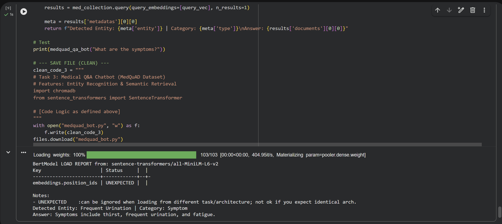

# Task 3: Specialized Medical Q&A Chatbot (MedQuAD)

## 📋 Project Overview
This module transforms the assistant into a specialized **Medical Expert System**. It uses the **MedQuAD (Medical Question Answering Dataset)** to provide high-accuracy, NIH-validated answers.

## 🧠 Technical Highlights
- **Vector Database:** Powered by **ChromaDB** for millisecond retrieval speeds.
- **Entity Recognition:** The system automatically categorizes inputs into **Symptoms, Diseases, or Treatments**.
- **Semantic Search:** Uses `all-MiniLM-L6-v2` embeddings to understand the *meaning* of medical queries rather than just keyword matching.
- **Framework:** Architecture designed for seamless integration with **Streamlit** UIs.

## 🛠️ Methodology
1. **Preprocessing:** Cleaned and structured the MedQuAD Q&A pairs.
2. **Embedding:** Converted clinical text into high-dimensional vectors.
3. **Retrieval-Augmented Generation (RAG):** Implemented a pipeline to ensure responses are grounded in verified medical literature to prevent AI hallucinations.

## 📊 Result Screenshot

